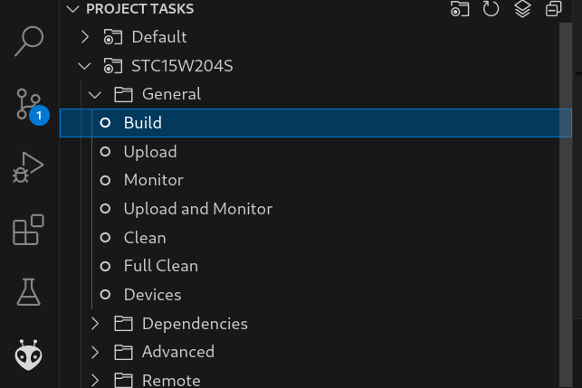
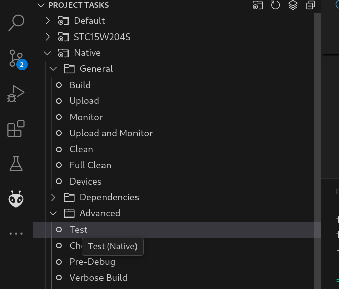
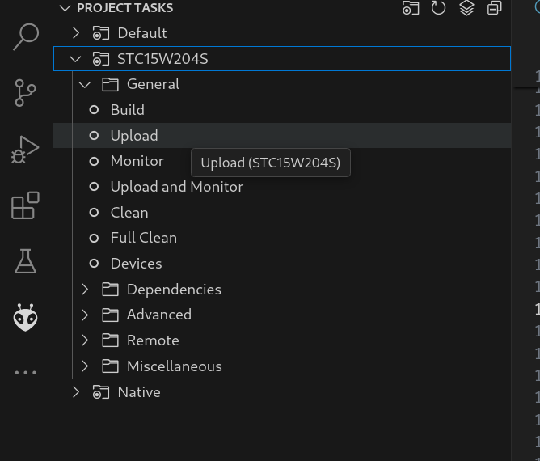
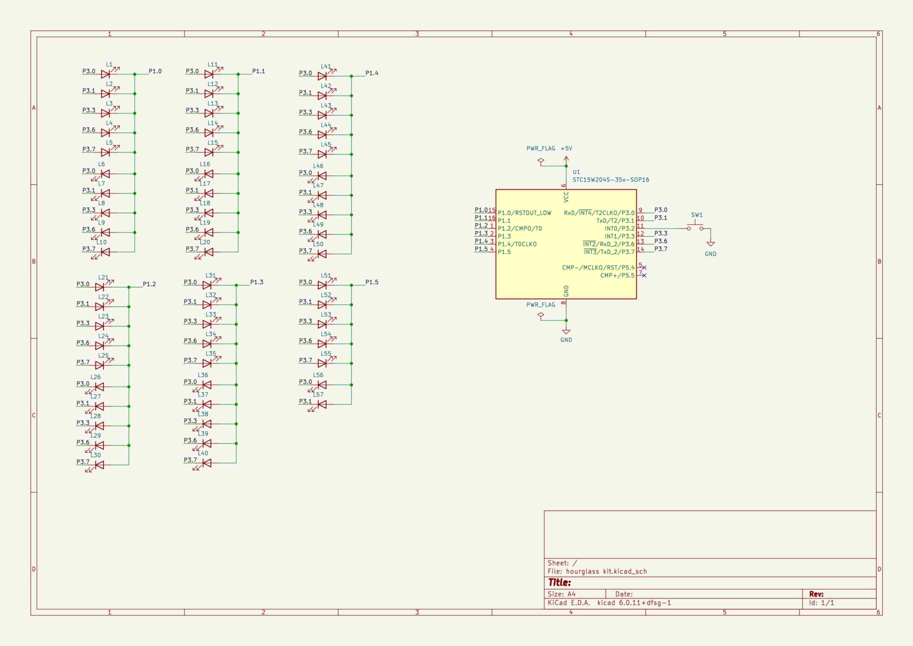
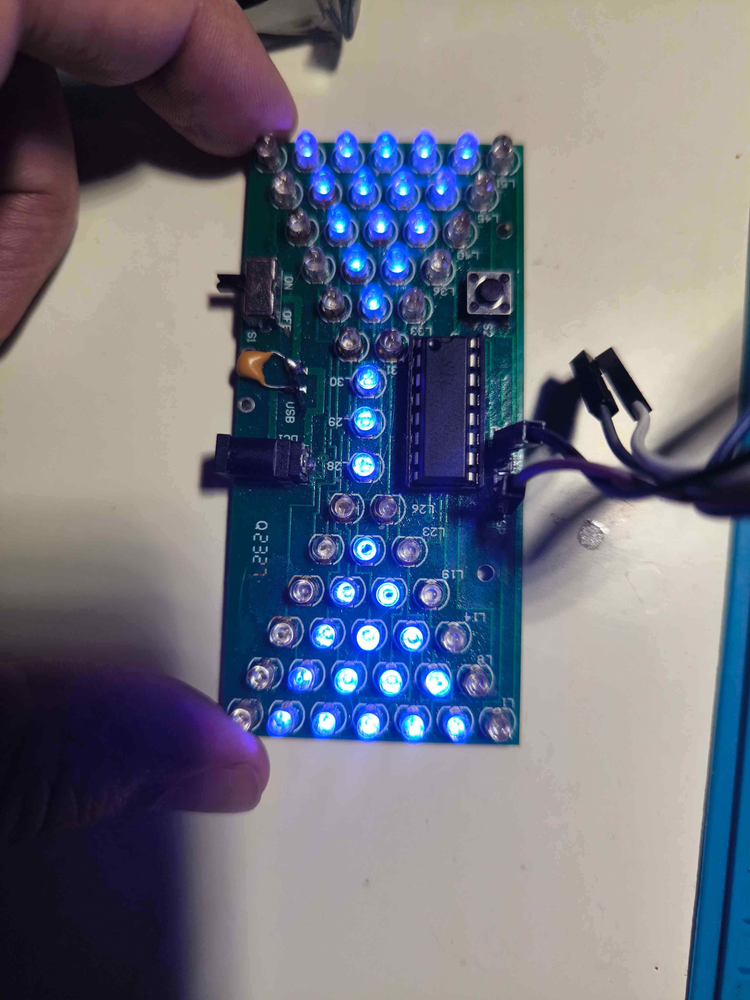
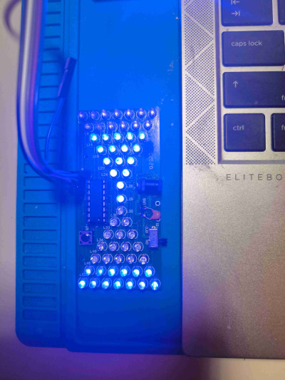

# Electronic hourglass kit programming examples  

This repository contains programming examples for electronic hourglass kit.

Examples written on C language and compiled with [SDCC](https://sdcc.sourceforge.net/)

> [!CAUTION]
> There is no way to download and save original firmware of the microcontroller.After first firmware upload orignal firmware was removed. 


## What is electronic hourglass kit

Electronic houglass kit is 57 LEDs driven by STC15W204S (or STC15W201S)

[Electronic houglass kit](https://www.icstation.com/hourglass-shaped-flashing-light-kits-simple-lamp-electronics-soldering-practice-stem-teaching-kits-p-12309.html)


## Additional hardware

To upload firmware you need USB-2-TTL adapter. I use CHG340g.


STC programmator is optional, but recommended for use.
[Additional info ](https://github.com/mgoblin/STC-programmator)    

# Fast track

All examples are prebuilded in firmware folder. You need stage8.hex or stage9.hex in your choice.

To upload firmare follow this steps
1. Install [stcgal](https://github.com/grigorig/stcgal)
2. Dont turn on power via other connectors. Connect USB-2-TTL adapter to hourglass kit board and plug it into USB. USB-2-TTL Rx to hourglass kit board Tx, USB-2-TTL Tx to hourglass kit board Rx, 5V to 5V. If you not use programmator do not connect board GND pin to USB-2-TTL in this step. 
4. Clone this code repository and open terminal in the cloned repository root directory
5. Run command 
```bash
    stcgal firmware/stage9.hex
```
6. Waiting for stcgal output 
``` Waiting for MCU, please cycle power: ``` and connect USB-2-TTL adapter GND to hourglass kit board GND. Waiting for stcgal output 
``` Disconnected! ```
7. Disconnect USB-2-TTL adapter and turn on power. As alternative way you can connect to hourglass kit board only GND and VCC pins of USB-2-TTL adapter.
8. Enjoy :)  

# Deep dive

Build tested in by me on Debian 12. You can build source code using Platformio IDE (recommended way) or from command line.

## Build examples prerequisites

This examples was developed in [Platformio IDE](https://platformio.org/) using C programming language.

You can build source code using Platformio IDE (recommended way) or from command line.

### Platformio (mandatory)

Follow instructions from [Platformio IDE](https://platformio.org/).
Run Platformio IDE and install 'Intel MCS-51 (8051)' and 'Native' platforms.

### SDCC compiler (optional)

SDCC is a C-compiler for small devices including STC microchips.
Its installed with Platformio Intel MCS-51 (8051) platform.
But you can install it separately for using in the command line.
On Debian SDCC can be installed via apt. 

Install need superuser permissions.
```bash
apt-get install sdcc
```

### gcc compiler (optional)

GCC compiler used for build unit tests. I wonder why you dont install gcc yet. 

### clang compiler (optional)

Clang compiler used for build unit tests.

### Scons (optional)
[SCons](https://scons.org/) is build tool used inside Platfromio. 
SCons based on Python

But you can install it separately for using in the command line.

```bash
pipx install scons
```


### stcgal (optional)
Stcgal is a firmware upload tool. Its installed inside and used by Platfromio.
Stcgal is written on Python and can be install separately from Platfromio. 

```bash
pipx install stcgal
```

## How to build examples

There are three ways to build the code.

### Build from Platformio IDE
Simpliest way to build firmware is to use Platformio IDE.

Run Platformio IDE.



You can also run local library tests.




### Build from command line using Platfromio core

To build firmware from root directory run in terminal 

```bash
pio run -e STC15W204S
```

For tests run 
```bash
pio test -e Native
```

### Build from command line using only SCons
To build firmware from root directory run in terminal
```bash
scons
```

## Upload firmware

### Upload from Platformio IDE

1. Connect USB-2-TTL adapter to hourglass kit board except GND
2. Select upload menu item from Platformio STC15W204S environment.
 and waiting for ```Cycling power: done``` output
3. Connect USB-2-TTL adapter GND pin to hourglass kit board except GND pin. 

### Upload from command line using Platfromio core

1. Connect USB-2-TTL adapter to hourglass kit board except GND
2. In the terminal from root folder run command
```bash
pio run -t upload -e STC15W204S
```
and waiting for ```Cycling power: done``` output

3. Connect USB-2-TTL adapter GND pin to hourglass kit board except GND pin.

### Upload from command line

Before upload firmware should be builded.

1. Connect USB-2-TTL adapter to hourglass kit board except GND
2. In the terminal from root folder run command
```bash
stcgal <file>
```
where file file is name of firmware hex file.

3. Waiting for ```Cycling power: done``` output
4. Connect USB-2-TTL adapter GND pin to hourglass kit board except GND pin.

# Electrical schema

The hourglass board has 57 LEDs, any combination of which the microcontroller can light, using just 12 I/O pins: the whole chip only has sixteen pins, and some of those are used for power, and sensing the push button.

Take a look at the circuit diagram



LEDs are grouped into 12 lines. Line numeration started from 0.
Each line excepth the last have 5 LEDs. Last line with number 11 have 2 LEDs.
Inside the line LEDs grouped by columns. There are 5 columns with numbers 0..4.

LEDs are driven by P3 and P1 pins. P1[0..6] and P30, P31, P33, P36, P37 used.
P1 select line and P3 select column.

P32 is used to connect push button.

LEDs doesnt have current-limiting resistors. MCU have total maximum current ~90mA. One MCU pin have maximum current ~20mA. Pin current is enough to drive LED, but in one moment only one LED should be turn on. The LEDs are multiplexed.

Even lines 0, 2, 4...10 are direct and odd lines 1, 3, 5.. 11 are reverse. 

To turn on LED in direct line P1x pin should have LOW value (logical zero) and P3x should have HIGH value (logical 1).
To turn on LED in reverse line P1x pin should have HIGH value (logical 1) and P3.x pin should have LOW value (logical 0).

To control this kind of matrix, the I/O pins have to be 'tri-state' type.
The microcontroller must be able to power each pin high, power the same pin low, or put that same pin into a high impedance ‘input’ state, where it effectively blocks any significant current from flowing in or out of it.

The STC15 chips achieve the tri-state operation (and more) for their I/O pins, by having PxM0 and PxM1 special function registers. That registers allow to control pins 
mode. There are four modes

| P1M1[0..7] | P1M0[0..7] | Mode                         |
|------------|------------|------------------------------|
|  0         |  0         |  quasi bidirectional         |
|  0         |  1         |  push-pull                   |
|  1         |  0         |  input-only (high-impedance )|
|  1         |  1         |  open Drain                  |

| P1M3[0..7] | P3M0[0..7] | Mode                         |
|------------|------------|------------------------------|
|  0         |  0         |  quasi bidirectional         |
|  0         |  1         |  push-pull                   |
|  1         |  0         |  input-only (high-impedance )|
|  1         |  1         |  open Drain                  |

We need push pull mode to turn LED on/off and input only otherwise.

For example for L1: line 0 driven by P10 and column 0 driven by P30. 
Line 0 is direct. L1 driven by P10 and P30.

Set the following values:

* P1M1 bit 0 to 0
* P1M0 bit 0 to 1
* P10 to 0
* P3M1 bit 0 to 0
* P3M0 bit 0 to 1
* P30 to 1 

Other bits of P1M1 = 1, P1M0 = 0

For L8: line is 1 and column 2. Line 1 is reverse. L8 driven by P11 and P33.
Set the following values:

* P1M1 bit 1 to 0
* P1M1 bit 0 to 1
* P11 to 1
* P3M1 bit 3 to 0
* P3M0 bit 3 to 1
* P33 to 0

# LED driving algorithms

C or assembler can be used to programming STC MCU. This examples is written on C programming language.

There are two popular C language compilers for 8051 MCU architecture: Keil and SDCC.
Keil is commertial, SDCC is free opensource compiler. Both have custom extensions. Keil C-language extentions doesnt compatible with SDCC, but may be easy translated.

This examples developed with STC15204S and STC15W201S compatibility in mind. 
Therefore maximum firmware size is less 1024 bytes. 

Examples split to stages. Stages demonstrate the growth of functionalty from simple to more complex levels. 

Stages source code is placed in stages subfolders.

## Stage 0. Install/configure sources and tools

Install and configure tools and build firmware from empty C language program. 

## Stage 1. Turn single LED on. 

***Step 1. Add STC hardware library.***  
Platfromio maintains centralized library registry. 

To programming STC MCU add STC15 hardware library. This library includes MCU registers definition and covinient routines to manipulate with MCU resources (frequency, timers and so on). 

Add to platfrom.io file lines
```ini
lib_deps = https://github.com/mgoblin/STC15lib.git#0.9.0
```

***Step 2. Create local library 'leds1' to turn led on/off*** 
A library is a way to manage complexity and separation of concerns.
Local libraries in platformio are located in the libs folder.

As an example of good firmware structure LEDs manipulation lib was created. Main method use library.

Leds1 library declares in leds1.h to functions:
 - ```void leds_off()``` to turn all leds off
 - ```void led_1_on()``` to turn on LED1.

 The STC hardware library makes implementation of the leds1 library functions very clear and straightforward.

 ```C
void leds_off()
{
    // All P3 and P1 pins should be in input only mode.
    // Pins in nnput only mode have high impedance and low current consuption.  
    pin_port_input_only_init(P3);
    pin_port_input_only_init(P1);
}
 ```

 See [STC hardware library pin module docs](https://mgoblin.github.io/STC15lib/docs/html/group__pin.html) for additional details.

***Step 3. Fast led on/off***  
All details of LED state manipulation is under the hood in the leds1 library. Main method of firmware is simple

```C
void main()
{
    while (1)
    {
        // Put all LEDs off 
        leds_off();
        f_delay_ms(LED_BLINK_DELAY_MS);
        
        // Put L1 on
        led_1_on();
        f_delay_ms(LED_BLINK_DELAY_MS);
    }
}
```
Rapid switching of the LED on and off is perceived by the human eye as the LED being constantly on.

>[!NOTE]
> LED1 and some other LEDs are biased by USB-2-TTL adapter. After firmware upload diconnect Rx and Tx pins from USB-2-TTL adapter.   

## Stage 2. Turn single LED on using timer.

In the stage1 led on/of code was placed in the main function and fast blinking was implemented using delays.

In stage2 code is moved to timer interrupt service routine.

***Step1. Initialize and start timer 0.***

As a first step timer is initialized and started in main function and main function go to endles waiting.

```C
void main()
{
    timer0_mode0_1T_init();
    timer0_mode0_start(TIMER_TICKS);

    while (1) {}
}
```

Timer interrupt routine is declared as 
```C
void timerISR() __interrupt(1) __naked
```

SDCC keyword `__interrupt` means that this is interrupt handler and argument 1 is interrupt number. Timer0 has interrupt number 1.

The second SDCC keyword `__naked` means that compiler shouled not generate prolog and epilog with stack pop/push for register save/restore and other auxiliary code. This allows you to reduce the firmware size, but requires explicit code to rerun from interrup`reti`.

We will not use `__naked` interrupt handlers in the next stages because it need manual controlling save/restore registers. But its possible.

***Step2. Implement timer0 interrupt handler.***

The second of the programming techniques is using bit flag variable inside interrupt handler (interrupt serive routine).

```C
__bit is_led_1_on = 0; // L1 On/Off bit flag 
```

STC15 have special SRAM bit addressable area and SDCC compiler have keyword `__bit` for bit flag type.

Alternative way to implement "memoizing" L1 state is check P3.0 and P1.0 pin values and mode. See the pseudo code below.

```C
bool is_led1_on()
{
    return P10 == 0 && P3.0 == 1 && <check P10 and P30 mode is push pull>
}
```

This way doesnt need additional SRAM, but increase code size.

We have the requirement to frimware size less then 1K and we dont exhause SRAM. Therefore bit flag is more preferable way to implement "memoizing" L1 state in this firmware.

## Stage 3. Turn on line 0 consists of L1-L5 LEDs. 

Stage 3 demostrate how to turn on line 0. Line 0 consists of L1, L2, L3, L4, L5. Line 0 is even line.

***Step 1. Initialize pins mode and timer 0***

Lets see the main function code. Its obviousю

```C
void main()
{
    // Initialzie P3 pins
    pin_port_pull_push_init(P3);
    P3 = LOW;

    // Initialzie P1 pins
    pin_port_input_only_init(P1);
    pin_push_pull_init(P1, 0);
    P1 = LOW;

    // Initialize and start timer 0 for L1-L5 turn on
    timer0_mode0_1T_init();
    timer0_mode0_start(TICKS_COUNT);

    while (1) {}
}
```

All P3 pins set to push pull mode and LOW (logical 0) value.
Only P10 pin initialized to push pull mode, other P1 pins is in input only mode.  
This combinataion of P1 and P3 modes is enabling put L1-L5 leds on/off by changing only P3 pins value. 


***Step 2. Turn L1-L5 on***

Timer 0 interrupt handler is responsible for cyclically fast sequentialy on/off one of L1-L5.

The P3 values ​​corresponding to the L1-L5 on/off states are stored in the P3_pins array. The current LED index is stored in the pins_idx variable.

The timer 0 interrupt handler sets the P3 value and increments pins_idx. In the case of L5 on, pins_idx is cleared to the initial value of 0.

```C
void timerISR() __interrupt(1)
{
    P3 = P3_pins[pins_idx];
    pins_idx == P3_PINS_COUNT - 1 ? pins_idx = 0 : pins_idx++;
}
```

The timer 0 interrupt period is set small enough to give the impression that all LEDs are on.

## Stage 4. Turn on all LEDs.

To turn on all leds main function doesnt changed, only timer 0 interrupt handler should be modified.

First of all `uint8_t led_column` and `uint8_t led_line` variables added to store current column and line.

The timer0 interrupt handler code is obvious, all details are moved to utility functions.

```C
void timerISR() __interrupt(1)
{
    turn_led_on(led_column, led_line);

    if (is_line_iterated(led_column))
    { 
        led_column = 0;
        next_line();
    } 
    else 
    {
        led_column++;
    }
}
```

***Step1. Turn led on by column and line***

Lets see `turn_led_on` function code. 

```C
void turn_led_on(uint8_t column, uint8_t line)
{
    uint8_t line_idx = line >> 1; // get P1 pin number into line_idx variable

    // Set P1.<line_idx> pin to push pull mode 
    pin_port_input_only_init(P1);
    pin_push_pull_init(P1, line_idx);

    if ((line & 0x01) == 0) // Is line odd or even?
    {
        // Line is even. P1 values need to be inverted
        P3 = P3_pins[column];
        P1 = ~P1_pins[line_idx];
    }
    else 
    {
        // Line is odd. P3 values need to be inverted
        P3 = ~P3_pins[column]; 
        P1 = P1_pins[line_idx];
    }
}
```

P1 pin number is equals to line/2.  

For even line LED P3 pin should have HIGH value (encoded in P3_pins[column]) and P1 should have LOW value. HIGH values for P1 are encoded in P1_pins[line_idx], therefore P1_pins[line_idx] value bits should be inverted. 

For odd lines P3[column] should be inverted to get P3 value and P1_pins[line_idx] not.

***Step 2. Change and store column and line for the next interrupt handler call***

Last part of interrupt handler is about changing line and column for the next handler call.

If all leds in then cureent line iteratred we need increment line nubmer and set column to 0 to start iterate next line, otherwise only increments column number.   
If we interate all lines line set to 0.

Function `is_line_iterated` implementation is very simple.

```C
bool is_line_iterated(uint8_t column) { return column == P3_PINS_COUNT - 1; }
```

And the next_line function is cyclically increment line number.

```C
void next_line()
{
    led_line = led_line == (P1_PINS_COUNT << 1) - 1 ? 0 : led_line + 1;
}
```

## Stage 5. Desсribe page and iterate through

So far so good, now it's time to finish the experiments and start the final implementation of the firmware.

First part of puzzle is how to describe the page? The second part is how to display page and the last puzzle part is how to change pages.

At this stage, the first and second parts of the puzzle will be solved.

***Step 1. Abstractions and design***

Animation is the series of pages. 

The page represents the on/off state of all 57 LEDs. 

Page display algorithm is: 

- get L1 state (on/off)
- if L1 state is on - turn on only this LED, other LEDs are off
- if L1 state is off - turn all LEDs off
- get next LED state
- if all 57 LEDs are iterated start over

Ok, how to describe "only this LED is on  or all LEDs off" in terms of electrical houglass kit? There is a state of P1M0, P1M1, P1, P3M0, PM31 and P3 registers.

How to implement the algorithm for displaying a page? And how to abstract the calculation of the next state of the LEDs from the application of the calculated state?

One possible answer is the iterator pattern.

Iterator is initialized with page description and has method next that return next state for displaying page. The state is a struct with P1M0, P1M1, P1, P3M0, PM31 and P3 fields. Iterator is endless, calling next to iterate page LEDs  over and over.


***Step 2. Page description format***

Each LED state is encoded as a bit. 1 - LED turn on state and 0 LED is off state.
Page is a set of bits. bit 0 is encode L1, bit 1 - L2 and so on, bit 56 endcode L57 state. Therefore page could be declare as a follows:

```C
typedef uint64_t ehgk_page_t;
```
First 57 bits (0-56) encode LED states and high bits from 57 to 63 are unused and always 0.

Some ofter used page templates could be declared as

```C
#define EMPTY_PAGE (uint64_t)0
#define ALL_LEDS_PAGE (uint64_t) 0x1FFFFFFFFFFFFF
```

Two page manipulation macros are defied as 

```C
#define ehgk_page_add_led(p, led)       (p |= led)
#define ehgk_page_delete_led(p, led)    (p &= ~led)
```

But for initial describe the page bitwise or operation will be used.
For convenience LED enum is declared as 

```C
typedef enum led_t
{
    L1  = (uint64_t) 0x1,
    L2  = (uint64_t) 0x2,
    L3  = (uint64_t) 0x4,
    L4  = (uint64_t) 0x8,
    L5  = (uint64_t) 0x10,
    L6  = (uint64_t) 0x20,
    L7  = (uint64_t) 0x40,
    L8  = (uint64_t) 0x80,
    ...
    L56 = (uint64_t) 0x80000000000000,
    L57 = (uint64_t) 0x100000000000000,
} led_t;
```

Using led_t enum page could be described as follows:

```C
ehgk_page_t page = L1 | L2; // Page with only L1 and L2 turn on.
```

***Step 3. Page iterator***

Page iterator should have two methods
- init for intiialize iterator with page 
- next for getting next state

This methods are declared as follows:

```C
void ehgk_iterator_init(ehgk_page_t page);
ehgk_iter_result_t* ehgk_iterator_next();
```

where ehgk_iter_result_t is

```C
typedef struct ehgk_iter_result_t
{
    uint8_t p3;
    uint8_t p1;
    uint8_t p3m0;
    uint8_t p3m1;
    uint8_t p1m0;
    uint8_t p1m1;
} ehgk_iter_result_t;
```

The iterator itself is declared as

```C
typedef struct ehgk_iterator_t
{
    ehgk_page_t page;
    uint64_t led_mask;
    uint8_t column_idx;
    uint8_t line_idx;
} ehgk_iterator_t;
```

where page is store page_t definition, led_mask stores iterated LED position, columnt_idx and line_idx stores iterated LED column and line numbers.

Iterator module implementation is contains declaration of variables

```C
/**
 * Module iterator instance
 */
ehgk_iterator_t iterator;

/**
 * Module last iteration result instance
 */
ehgk_iter_result_t iter_result;

```

The implementation of iterator methods is discussed in the next step.

***Step 4. Puts all together into the library***

The implementation of iterator methods is reused in this and next stages. Therefore, it makes sense to move them to a separate library. This library is placed to lib/ehgk_page folder.

Library files are:
| File                  | Description                                   |
|-----------------------|-----------------------------------------------|
| ehgk_page.h           | page_t and page manipulation macroses         |
| ehgk_page_iterator.h  | iterator structures and methods declarations  |
| ehgk_page_iterator.c  | iterator methods implementation               |

Lets see iterator mehtods implementation.

Init method is simple. Its store page value into internal iterator state, make initial led mask value corresponding to L1 mask (bit0 is 1) and reset column and line values.

```C
void ehgk_iterator_init(ehgk_page_t page)
{
   //Save page and reset iterator state
   iterator.page = page;
   iterator.led_mask = 1;
   iterator.column_idx = 0;
   iterator.line_idx = 0;
}
```

Method next is more complex. Its consists of two parts
 - Generate P1 and P3 pins values and modes 
 - Prepare to the next iteraction. Increment internal state.

The first part fills iter_result variable. The second part shift left led_mask and increment column and line indexes.   
Both parts used algorithms from previous stage. The iterate_result calculation algorithm takes into account the need to leave contact P32 always in the input only mode.  

***Step 5. Unit tests***

One of the advantages of separating the computation of state and its applying is possibility to unit testing of ehgk_page library.

There are few approaches to microcontroller unit testing
- testing on embedded target (on real mcu deive)
- testing on emulator
- testing on native platfrom (for example linux) 

First to approaches is unavailable or hard in STC platform.

Native tests are intended for the project components that are independent of physical hardware. 

ehgk_page library is independed from hardware, because it not use direct MCU registers getting/setting. Library can be build with gcc or clang for native plaform (in my case linux ) with unit test library dependency. [Unity](http://throwtheswitch.org/) used as unit test library. 

Platformio has Unity testing support "from the box". All you need place unit tests code in test folder. But this is not big deal to build and run tests from command line.

The first approach start plaformio from command line

```bash
pio test -e Native
```

The second approach is build tests to executable binary and run it 

Both approaches supported. 

Unit tests sources entry point is test/main.c

```C
#include <unity.h>
#include "ehgk_page_test.h"
#include "ehgk_page_iterator_test.h"

void setUp(void) {
    // set stuff up here
}

void tearDown(void) {
    // clean stuff up here
}

int main( int argc, char **argv) {
    UNITY_BEGIN();

    RUN_TEST(test_ehgk_page_value_is_empty_after_init);
    RUN_TEST(test_ehgk_page_add_led1);
    RUN_TEST(test_ehgk_page_add_led2);
    RUN_TEST(test_ehgk_page_add_leds_1_2);

    RUN_TEST(test_ehgk_page_delete_led1_from_empty_page);
    RUN_TEST(test_ehgk_page_delete_led1);
    RUN_TEST(test_ehgk_page_delete_led2);
    RUN_TEST(test_ehgk_page_delete_led_1_2);

    RUN_TEST(test_iterator_init);
    RUN_TEST(test_iterate_once_empty_page);
    RUN_TEST(test_iterate_once_one_led_page);
    
    RUN_TEST(test_iterate_line0_columns_empty_page);
    RUN_TEST(test_iterate_line0_columns_L1_page);
    RUN_TEST(test_iterate_line0_columns_L2_page);
    RUN_TEST(test_iterate_line0_columns_L3_page);
    RUN_TEST(test_iterate_line0_columns_L4_page);
    RUN_TEST(test_iterate_line0_columns_L5_page);

    RUN_TEST(test_iterate_line0_columns_L2_L3_page);

    RUN_TEST(test_iterate_line1_empty_page);
    RUN_TEST(test_iterate_line1_all_columns_page);
    RUN_TEST(test_iterate_all_lines_empty_page);

    UNITY_END();
}
```

Its imports untiy.h header and Run test cases. Testcases split into to suites - page tests and iterator tests.    
Test suite is C source file with test cases. Test case is a C function that use Unity macroses to asserting expected and actual values. 

***Step6. Main program***

Now that all the "magic" of calculating the LED state is encapsulated in the ehgk_page library, we can start developing the main program.

The main program simply turns on all the LEDs excluding outer ones.



```C
/*======================== STC15 HAL headers ====================================*/
#include <pin.h>
/*========================End of STC15 HAL headers ==============================*/

#include <ehgk_page_iterator.h>

extern ehgk_iterator_t iterator;
extern ehgk_iter_result_t iter_result;

void main()
{
    ehgk_iterator_init(
        L2 | L3 | L4 | L5 | L6 | 
         L9 | L10 | L11 | L12 |
          L15 | L16 | L17 |
             L20 | L21 |
                L24 |

                L28 |
                L29 |
                L30 |
                
                L34 |
             L37 | L38 |
          L41 | L42 | L43 |
         L46 | L47 | L48 | L49 |
        L52 | L53 | L54 | L55 |L56
    ) ;

    while (1)
    {
        ehgk_iterator_next();

        P1 = iter_result.p1;
        P3 = iter_result.p3;
    
        P1M0 = iter_result.p1m0;
        P1M1 = iter_result.p1m1;
        P3M0 = iter_result.p3m0;
        P3M1 = iter_result.p3m1;
    }
}
```

For the firmware size minimization extern variable `iter_result` declared. This variable holds last call result of `ehgk_iterator_next()`.  

## Stage 6: Move the page display inside the timer

In the previous stage main program routine was apply page state. Continuous calculation and page refresh takes too much CPU time. Moving this functionality to the timer enhances firmware. 

```C
/*======================== STC15 HAL headers ====================================*/
#include <pin.h>
#include <timer0_mode0.h>
/*========================End of STC15 HAL headers ==============================*/

#include <ehgk_page_iterator.h>

extern ehgk_iterator_t iterator;
extern ehgk_iter_result_t iter_result;

void timerISR() __interrupt(1)
{
    ehgk_iterator_next();

    P1 = iter_result.p1;
    P3 = iter_result.p3;

    P1M0 = iter_result.p1m0;
    P1M1 = iter_result.p1m1;
    P3M0 = iter_result.p3m0;
    P3M1 = iter_result.p3m1;
}

void main()
{
    ehgk_iterator_init(
        L2 | L3 | L4 | L5 | L6 | 
         L9 | L10 | L11 | L12 |
          L15 | L16 | L17 |
             L20 | L21 |
                L24 |

                L28 |
                L29 |
                L30 |
                
                L34 |
             L37 | L38 |
          L41 | L42 | L43 |
         L46 | L47 | L48 | L49 |
        L52 | L53 | L54 | L55 |L56
    );

    
    timer0_mode0_1T_init();
    timer0_mode0_direct_start(0xF5, 0x00);

    while (1)
    {
    }
}
```

## Stage 7. Animate picture inside main function

Now we can describe and statically displaying one page. Lets start animation.

***Step 1. Keeping page sequence***

A page animation is simply an array of pages. It is declared in the separate header file `pages_definition.h`. 

There are two page animations. The first one is main animation of upper and lower triangles and the second one is LED29-LED30 auxialiary animation for the sand flow.    
The main animation have 29 pages and sand flow animation have only two pages. The main animation is very similar but not the same as ogiginal firmwares. I deliberately did not repeat the algorithm for turning on and off the LEDs from the original firmware, but you can easily make the necessary changes to the main animation

***Step 2. Animate pages***

Here we step back and implements page displaing and swaping pages in main function. This decision take smaller firmware size, but not such elegant as using timer to page displaying. 

First lets see function to display page for some time 

```C
void displayPage(uint16_t iteration_delay_ticks)
{
    // Iterate through page LEDs and on/of LEDs according to page definition
    for(uint16_t i = 0; i < iteration_delay_ticks; i++)
    {
        ehgk_iterator_next();

        P1 = iter_result.p1;
        P3 = iter_result.p3;

        P1M0 = iter_result.p1m0;
        P1M1 = iter_result.p1m1;
        P3M0 = iter_result.p3m0;
        P3M1 = iter_result.p3m1;
    }
}
```

Time to dispalyaing page get in the function parameter and using as iterations count.

The main funtion is straigforward and easy readable

```C
void main()
{
    while (1)
    {
        // Iterate through pages
        for(uint8_t page_idx = 0; page_idx < PAGES_COUNT; page_idx++)
        {
            // Select next page to display
            ehgk_iterator_init(pages[page_idx]);
            // Display current page
            displayPage(ORDINAL_PAGE_DELAY);
            
            // Animate sand flow
            for(uint8_t idx = 0; idx < L29_L30_PAGES_COUNT; idx++)
            {
                ehgk_iterator_init(pages[page_idx] | l29_l30_pages[idx]);
                displayPage(SAND_FLOW_DELAY);
            }
        }
    }
}
```
The firware size is 965 bytes. Good enough.

[](https://raw.githubusercontent.com/mgoblin/ElectronicHourGlassKit/main/images/stage7.mp4)

## Stage 8. Changing animation speed

***Step 1. Button push handler stub***

***Step 2. Changing animation speed using clock frequency divider***

## Stage 9. New animation pattern

Creating new aniamations.

# Similar DIY projects

## Ceptimus firmware

## Rick-100 firmware

# Next ideas

## Other ways to changing animation speed
 
## Using idle mode to reduce power consumption

## Storing pages into the EEPROM

## Creating pages and animation visual editor

